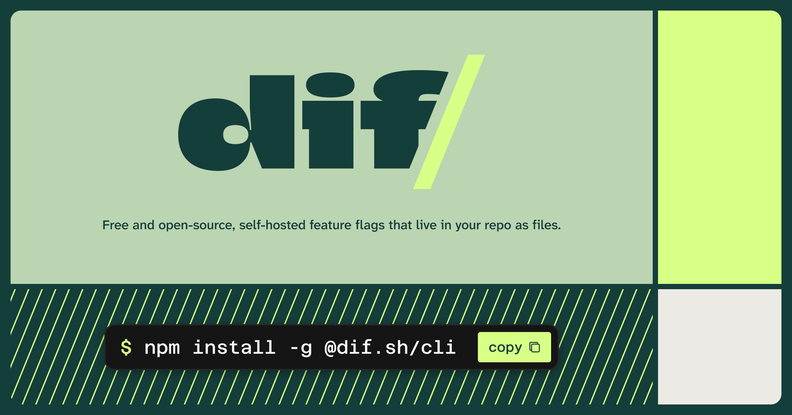
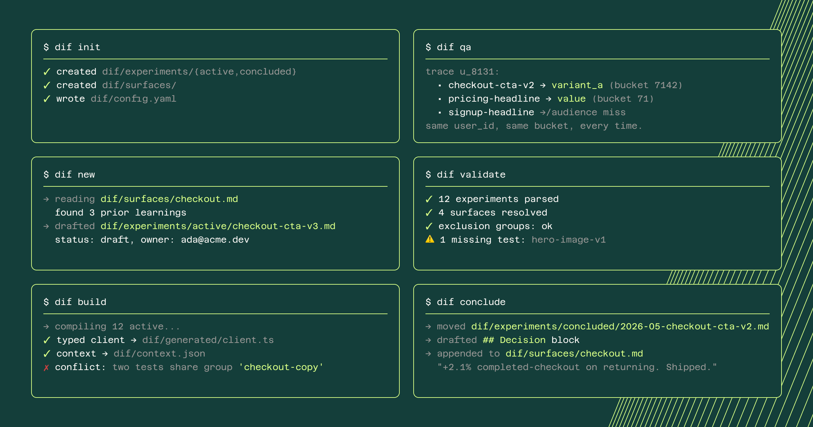
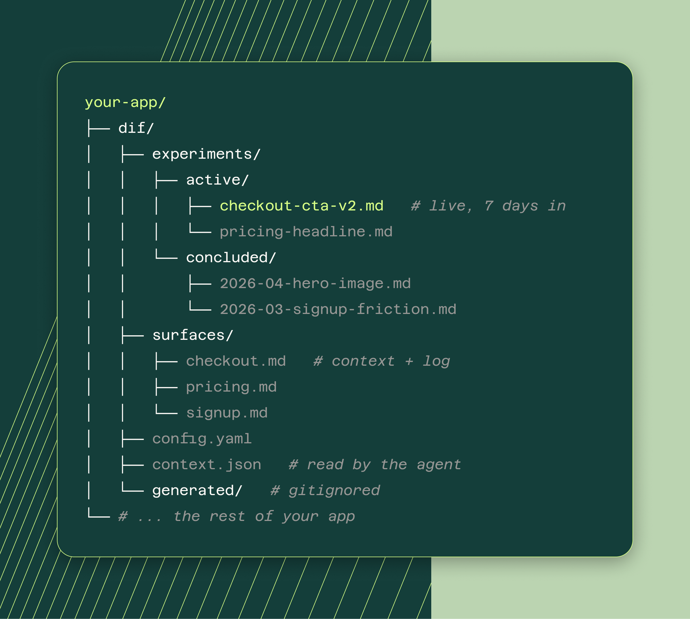
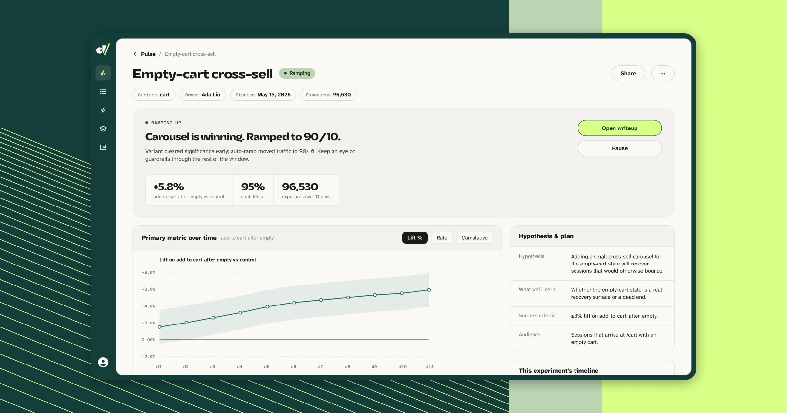
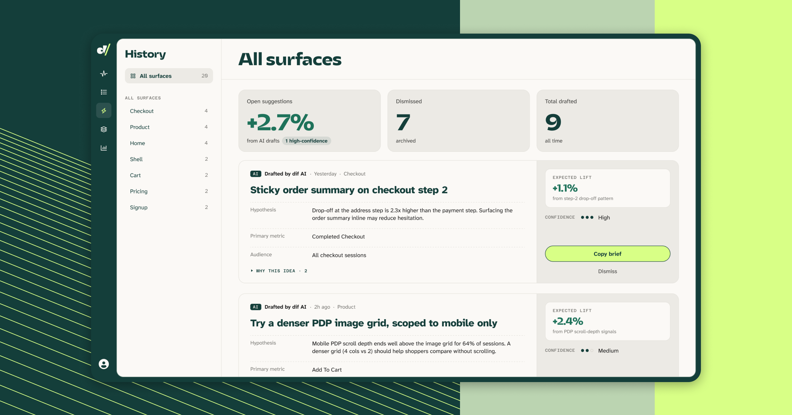
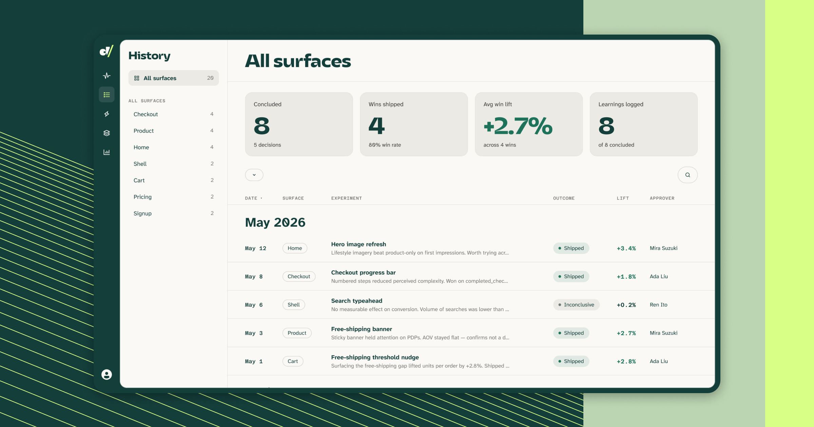

<p align="center">
  <a href="https://www.dif.sh">
    
  </a>
</p>

<h3 align="center">Feature flags and A/B tests that live in your repo as Markdown files.<br>One command to install. No signup. No dashboard to rot in.</h3>

<p align="center">
  <a href="https://www.npmjs.com/package/@dif.sh/cli"></a>
  <a href="https://www.npmjs.com/package/@dif.sh/cli"></a>
  <a href="https://github.com/dif-sh/dif/actions/workflows/ci.yml"></a>
  <a href="LICENSE"></a>
</p>

<p align="center">
  
  <a href="https://www.npmjs.com/package/@dif.sh/sdk"></a>
  
  
  
</p>

---

## Contents

- [Quickstart](#quickstart)
- [The eight commands](#the-eight-commands)
- [Why dif?](#why-dif)
- [What lands in your repo](#what-lands-in-your-repo)
- [A flag / experiment](#a-flag--experiment)
- [Using the CLI](#using-the-cli)
- [Working with agents](#working-with-agents)
- [Analytics](#analytics)
- [dif.sh Cloud](#difsh-cloud)
- [Development](#development)
- [License](#license)

## Quickstart

```sh
npm install -g @dif.sh/cli
```

<details>
<summary>No Node? Install the standalone binary</summary>

```sh
# macOS / Linux: single static binary, no Node required
curl -fsSL https://dif.sh/install.sh | sh
```

</details>

Then, in your repo:

```sh
dif init                                # scaffold dif/, config, agent files
dif connect --key dif_pk_live_...       # connect to dif.sh Cloud (optional)
dif new home-hero-cta --surface home    # draft an experiment file
# open dif/experiments/active/home-hero-cta.md and set `status: active`
dif validate                            # check everything
dif build                               # generate the TS client + context.json
```

**Or use the built-in skills.** `dif init` installs Claude Code skills into
`.claude/skills/`, so you can drive the same loop in plain English and let the
agent run the commands:

| Skill | Ask for |
| --- | --- |
| `dif-generate-surfaces` | *"Set up dif surfaces for this app"* — reads your routes and pages, proposes the surface set, writes the files |
| `dif-author-experiment` | *"Add a flag for the new checkout, mobile only"* — drafts the frontmatter, picks weights, runs `dif validate` |
| `dif-conclude-experiment` | *"Conclude checkout-cta-v2, variant won, ship it"* — writes the decision, archives the file, logs the learning |

`dif new` drafts the file with your git email as owner. Open it, write the
hypothesis, set `status: active`, and run `dif build`. Then install the
runtime (`npm install @dif.sh/sdk`, zero dependencies), import the generated
client once at boot, and call `dif()` at the render site:

```ts
import "./dif/generated/client";
import { attributes } from "./dif/generated/audiences";
import { dif } from "@dif.sh/sdk";

dif.init({
  userId: () => currentUser?.id ?? null,
  attributes: () => attributes(),
});

const cta = dif("home-hero-cta", {
  control:   () => "Start free trial",
  variant_a: () => "Try it free for 30 days",
});

button.textContent = cta();
```

`dif init` gitignores `dif/generated/`, so CI/deploy must run `dif build`
before the app build or it'll ship without a client. Add `"prebuild": "dif
build"` to `package.json` and it happens automatically.

The npm packages (`@dif.sh/sdk`, `@dif.sh/react`, `@dif.sh/svelte`) are
ESM-only — there's no `require()` entry point.

Full documentation lives at [www.dif.sh/docs](https://www.dif.sh/docs).

## The eight commands



| Command | What it does |
| --- | --- |
| `dif init` | Scaffold the dif.sh convention in the current directory. |
| `dif connect` | Connect the workspace to dif.sh Cloud with a publishable key. |
| `dif new` | Draft a new experiment, informed by the surface's prior learnings. |
| `dif validate` | Check the workspace: schema, owners, surface refs, exclusion graph. |
| `dif build` | Compile active experiments into a typed TS client + context.json. |
| `dif qa` | Trace the assignment chain for a user and emit a preview URL. |
| `dif conclude` | Move an experiment to concluded/, draft Decision, append to surface log. |
| `dif scaffold-audiences` | Idempotently scaffold the starter audience resolvers (locale, device_type). |

## Why dif?

A feature flag is part of your codebase. So it should live in your repo.

Every flag and every experiment in dif is one Markdown file, checked into git
next to the code it changes. It gets reviewed in a pull request. Its history
is the git history. When it is done, the decision and what you learned go in
the same file.

The alternative is what most teams have now. Flags live in a web dashboard,
disconnected from the code, and they rot there. Nobody remembers why
`new-checkout-v2` exists or whether it is safe to delete, so it sits at 100%
for three years with a dead branch behind it. Experiment results end up in
someone's old Slack thread and the same failed test gets re-run two years
later.

Files also mean assignment can be a pure function. There is no assignment database and no network request to evaluate a
flag, and a user never flips between variants across page loads or devices. The same math runs in the Rust CLI and the
TypeScript SDK, locked by a shared test fixture that fails CI on both sides
if the two implementations drift by a single bucket.

## What lands in your repo

<p align="center">
  
</p>

## A flag / experiment

Both are the same file format. Here is a flag mid-ramp:

```md
---
id: new-checkout
status: active
owner: sam@acme.com
surface: checkout
hypothesis: >
  Inlining the address form will lift completed checkouts on mobile
  without moving refunds.
audience:
  include:
    - device_type: [mobile, tablet]
  exclude:
    - plan: free
variants:
  - id: "off"
    weight: 90
    summary: Current checkout
  - id: "on"
    weight: 10
    summary: Rebuilt checkout with the address form inlined
metrics:
  primary: completed_checkout
  guardrails:
    - refund_rate
exclusion_group: checkout
created: 2026-07-01
---

## Brief

Ramp to 25% once the guardrails hold for a week.
```

And an experiment:

```md
---
id: checkout-cta-v2
status: active
owner: sam@acme.com
surface: checkout
hypothesis: >
  A CTA that names the outcome ("Pay $49") beats the generic "Continue"
  at the final step.
variants:
  - id: control
    weight: 50
  - id: variant_a
    weight: 50
metrics:
  primary: completed_checkout
  guardrails:
    - refund_rate
exclusion_group: checkout
created: 2026-07-01
---
```

The only structural difference is the weights. A flag is an experiment you
are ramping toward 100%. An experiment is one you are holding at a split
until the numbers answer the hypothesis. Same schema, same bucketing math,
same validator, same SDK call. An experiment that wins becomes a flag you
ramp, and a flag you are unsure about becomes an experiment, without touching
a line of application code.

(The shared `exclusion_group` is there because both are live on the checkout
surface at the same time. More on that below.)

## Using the CLI

`dif validate` is a type checker for your experiments. Weights must total
100. Referenced surfaces and audience attributes
must exist. It also scans your application source for `dif("...")` call sites
and warns when code points at an experiment that is not in the repo. Run it
in CI and a broken flag fails the PR like a broken build.

It catches experiment collisions too. Two active experiments on
the same surface must either share an `exclusion_group`, which guarantees
each user sees at most one of them, or have audiences that provably cannot
overlap. If dif cannot prove separation, validation fails.

`dif qa --user u_8131 --attr device_type=mobile` shows which variant that
user gets and why. Add `--force checkout-cta-v2=variant_a` and it also returns a preview link (`?_dif=...`) that pins the variant in a browser. Forced assignments don't fire exposure events.

`dif conclude` records the decision, dates it, moves the file to
`dif/experiments/concluded/`, and appends a one-line learning to the surface.
The next `dif new` on that surface reads those learnings into the draft, so
the same failed idea does not get rebuilt by someone new in two years.

`dif build` compiles everything the runtime needs: a typed client at
`dif/generated/client.ts`, audience resolvers, event delivery, and
`dif/context.json` for your agent.

## Working with agents

`dif init` merges a managed block into `CLAUDE.md`, `AGENTS.md`, and
`.cursorrules`, and installs Claude Code skills for authoring experiments,
concluding them, and generating surfaces. `dif build` writes
`dif/context.json`: every active experiment, plus the most recent learning on
each surface.

Use `--agents` to scaffold only a subset: a comma-separated list of `claude`
(`CLAUDE.md` + the `.claude/skills/dif-*` skills), `general` (`AGENTS.md`),
`cursor` (`.cursorrules`), or `none`. Omit the flag to install all three.
`--agents none` writes no agent files (the former `--no-agent-files`, now a
hidden alias).

This is the part a dashboard cannot do. In dif the flags are
files, so the agent reads them like any other source and writes them the same
way. Tell it to add a flag for the new checkout and it can draft the file,
gate the code path, and run `dif validate` to check its own work.

## Analytics

You can run dif with no analytics at all. Assignment is local, so flags and
ramps work with nothing configured. Cloud mode is opt-in too: without a
publishable key, dif records nothing to Cloud until you run `dif connect` —
no warning, just silence.

When you want more analysis, connect to dif.sh Cloud. Copy the command from
cloud onboarding and run it in your repo:

```sh
dif connect --key dif_pk_live_...   # writes the key to dif/config.yaml, turns on cloud mode
```

New project? `dif init --key dif_pk_live_...` scaffolds and connects in one
step. Either way the key lands in `dif/config.yaml` (it's a publishable key,
safe to commit) and `dif build` bakes it into the generated client — so `init`
stays clean, with no env var and no key pasted into code:

```ts
import { events } from "./dif/generated/events"; // cloud config + your key

dif.init({
  events,
  userId: () => currentUser?.id ?? null,
});
```

If you already have an events pipeline, run `dif init --events custom`
instead. That scaffolds `dif/events/exposure.ts` and `dif/events/track.ts`,
two handlers you own. Forward events to Segment, Amplitude, a webhook, or
whatever you run; dif does not care where they go. There are no bundled
third-party integrations, just those two functions.

Metric tracking is one call either way:

```ts
dif.track("completed_checkout");
dif.track("revenue", { value: 49 });
```

## dif.sh Cloud

Cloud handles event ingest, metrics, and statistical analysis. It runs hosted
at [cloud.dif.sh](https://cloud.dif.sh). Nothing in the core requires it — the
files in your repo stay the source of truth.

**Pulse** — read an experiment while it runs: lift, confidence, exposures, and
the hypothesis you wrote in the file sitting right next to the chart.



**Suggestions** — dif reads your surfaces, your concluded experiments, and the
behaviour in your data, then drafts the next test with a hypothesis and an
expected lift. Copy the brief straight into `dif new`.



**History** — every concluded experiment across every surface, with the
outcome, the lift, and who approved it. The same learnings that get appended
to your surface files.



## Development

```text
cli/
  crates/dif-core/   # parser, validator, bucketing, codegen (Rust)
  crates/dif-cli/    # the `dif` binary
  packages/cli/      # @dif.sh/cli, the npm wrapper
  packages/sdk/      # @dif.sh/sdk, the runtime SDK (TypeScript, zero deps)
  packages/react/    # @dif.sh/react
  packages/svelte/   # @dif.sh/svelte
dist/                # install.sh + Homebrew tap template
```

```sh
cd cli
cargo test --workspace       # Rust: parser, validator, codegen

cd packages/sdk
npm install && npm test      # TS
```

## License

MIT. See [LICENSE](LICENSE).
